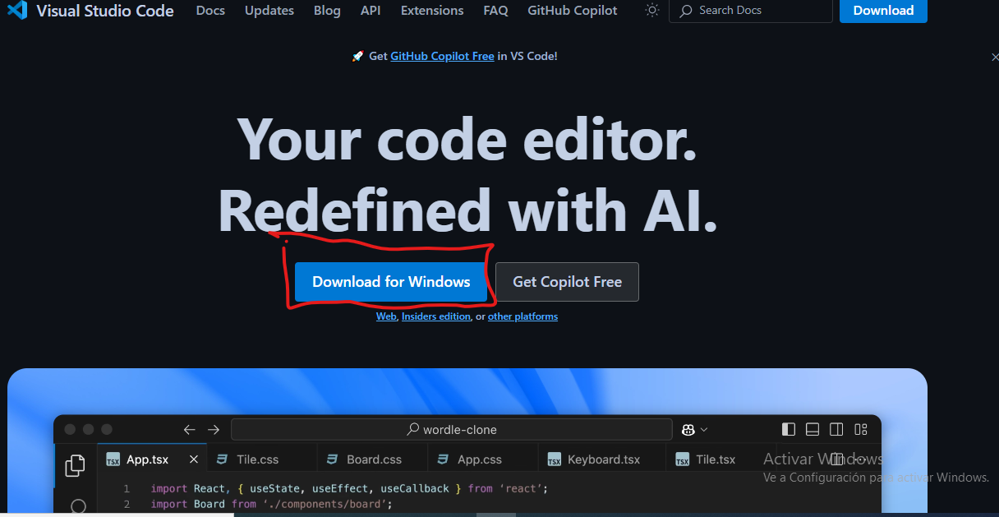
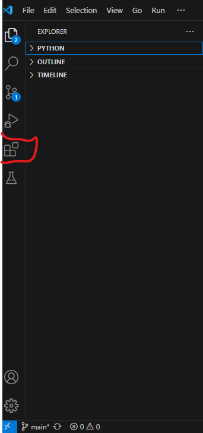
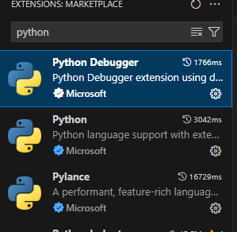
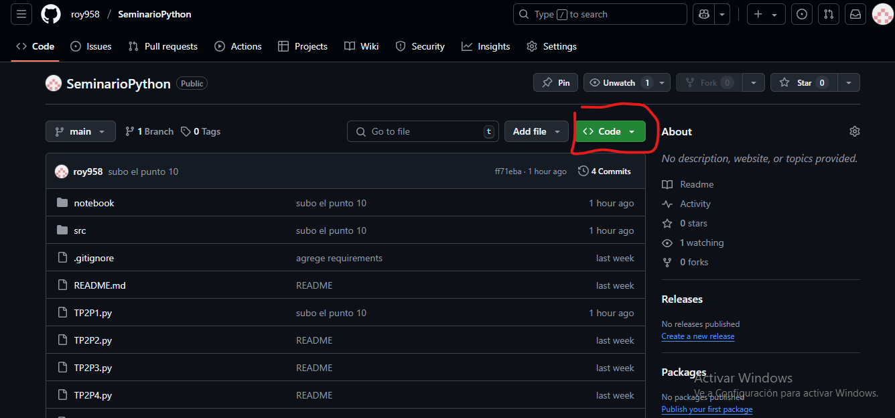
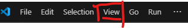
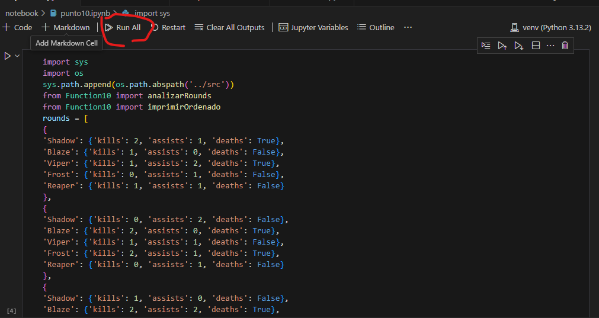

### Roy Ariel Arias 26265/5
### descripcion:
   - resolucion del punto 10 de la practica 2 de seminario de python.
   - como descgargarlo y ejercutarlo.
### como instalar python y correr el codigo.
   1. Descargar python.
     segui los pasos de este link 
      https://python-unlp.github.io/blog/2023/04/22/instalaci%C3%B3n-de-python/

   2. descagar visual studio code.
    - anda a este enlace.
      https://code.visualstudio.com/ 

     

     - se te va a descargar automaticamente. Cuando termine, ejecutalo  y completa la descarga.
  3. ejecute el visual studio code. 
     - Ahora tendra que descargar las extensiones.

      

     - Toque donde ve en la imagen.
     - Luego en el buscador de exensiones, busque python.
      
     
      
     - descargue esas extensiones.
  4. descargue el archivo . zip 
      
      
    -  aprete donde ve, luego descargue el archivo  en download ZIP.
    - cuando se descargue, de click derecho sobre el archivo, aprete extraer aqui.
    - luego de esto, haz click en file.
     
     
      
     - haz click en open file, luego de esto busque la carpeta que extrajo del archivo.zip y haz doble click.
  5. crea un entorno virtual.
     - segui los pasos de este link.
      https://python-unlp.github.io/blog/2023/04/29/entornos-virtuales/
     - luego de esto, abre la terminal de visual studio code 

     
      
     - toque donde muestra la imagen, y aprete en terminal.
     - escriba lo siguiente.
      `pip install -r requirements.txt`
     - luego aprete enter.
  6. ejercutar codigo.
     -  dirigase a la carpeta(en explorer) notebook/ haga click en punto10.ipynb, luego ejecute el codigo en run all.
      
      